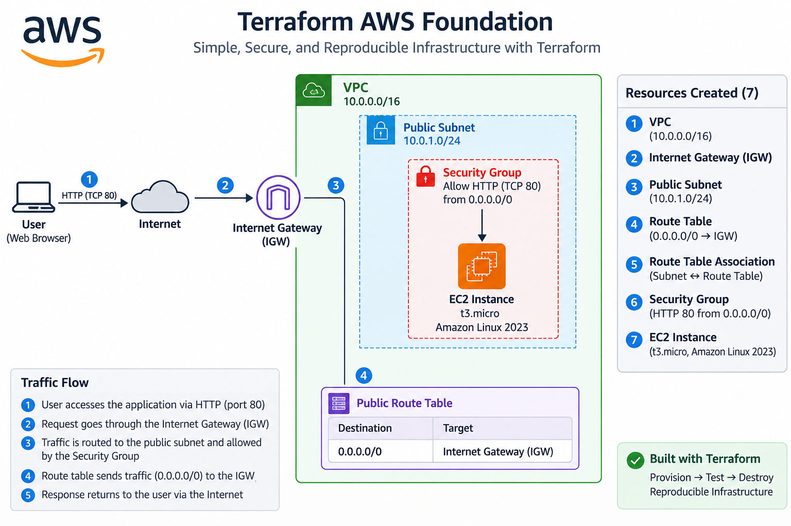

# Terraform AWS Foundation

## Overview

This project demonstrates how to provision a simple AWS infrastructure environment using Terraform.

The infrastructure includes a VPC, public subnet, Internet Gateway, route table, security group, and an Amazon EC2 instance running Amazon Linux 2023.

The goal of this project is to demonstrate practical Infrastructure as Code (IaC) skills using Terraform and AWS, including the complete Terraform workflow from initialization and validation to deployment and resource cleanup.

## Architecture

The infrastructure is deployed in the AWS Singapore Region (`ap-southeast-1`) and consists of a simple public web server architecture.



- VPC: `10.0.0.0/16`
- Public Subnet: `10.0.1.0/24`
- Internet Gateway for internet connectivity
- Public Route Table with a route to `0.0.0.0/0`
- Security Group allowing inbound HTTP traffic on TCP port 80
- Amazon EC2 `t3.micro` instance running Amazon Linux 2023


## Resources Created

This project provisions the following AWS resources using Terraform:

| Resource | Purpose |
|---|---|
| VPC | Provides an isolated network environment for the infrastructure |
| Public Subnet | Hosts the EC2 instance and allows public IP assignment |
| Internet Gateway | Provides internet connectivity for the VPC |
| Route Table | Routes outbound internet traffic through the Internet Gateway |
| Route Table Association | Associates the public subnet with the public route table |
| Security Group | Allows inbound HTTP traffic on TCP port 80 and outbound traffic |
| EC2 Instance | Runs an Amazon Linux 2023 virtual server |


## Terraform Workflow

The infrastructure was provisioned and tested using the standard Terraform workflow:

```bash
terraform init
terraform fmt
terraform validate
terraform plan
terraform apply
```

After verifying the deployed resources in AWS, the infrastructure was removed using:
```bash
terraform destroy
```

The deployment was successfully completed with 7 resources created, and the same 7 resources were subsequently destroyed after testing.

## Continuous Integration

This repository uses GitHub Actions to automatically validate the Terraform configuration on pushes and pull requests.

The CI workflow performs:

- `terraform fmt -check`
- `terraform init -backend=false`
- `terraform validate`

The workflow validates the Terraform configuration without automatically deploying AWS resources.

`terraform apply` is intentionally excluded from the CI workflow to keep the portfolio environment safe and avoid unintended infrastructure changes.


## Prerequisites

Before using this project, ensure the following tools are installed and configured:

- Terraform CLI
- AWS CLI
- An AWS account
- Valid AWS authentication configured locally

Terraform uses the AWS Provider to communicate with AWS APIs. AWS credentials are not stored in this repository.


## How to Use

Clone the repository and navigate to the project directory.

Initialize Terraform:

```bash
terraform init
```

Format the Terraform configuration:

```bash
terraform fmt
```

Validate the configuration:

```bash
terraform validate
```

Review the infrastructure changes:

```bash
terraform plan
```

Deploy the infrastructure:

```bash
terraform apply
```

Review the Terraform execution plan carefully before confirming the deployment.


## Cleanup

To remove the AWS resources created by this project:

```bash
terraform destroy
```

Always review the destroy plan before confirming the operation.

For this project, the infrastructure was destroyed after testing to avoid leaving unnecessary AWS resources running.


## Security Considerations

This repository follows several basic security practices:

- AWS credentials are not stored in Terraform configuration files.
- Terraform state files are excluded from Git using `.gitignore`.
- Terraform variable files (`*.tfvars`) are excluded because they may contain sensitive values.
- The `.terraform` directory is excluded from version control.
- The `.terraform.lock.hcl` file is committed to version control for provider dependency consistency.

The current Security Group allows inbound HTTP traffic on TCP port 80 from `0.0.0.0/0` for demonstration purposes.

For a production environment, additional security controls should be considered, such as HTTPS, more restrictive network access, least-privilege IAM permissions, and secure secret management.


## Cost Considerations

This project creates AWS resources that may incur charges depending on the AWS account, region, resource usage, and current AWS pricing.

To minimize unnecessary costs:

- Review `terraform plan` before deployment.
- Create resources only when required for testing.
- Run `terraform destroy` after testing when the infrastructure is no longer needed.
- Use AWS Budgets and billing tools to monitor usage and costs.

This project is intended as a small learning and portfolio environment rather than a production workload.


## What I Learned

Through this project, I gained hands-on experience with:

- Provisioning AWS infrastructure using Terraform.
- Building a VPC and public subnet architecture.
- Connecting a VPC to the internet using an Internet Gateway.
- Configuring routing using route tables and route table associations.
- Controlling network traffic using Security Groups.
- Deploying an EC2 instance using a dynamically retrieved Amazon Linux 2023 AMI.
- Understanding the relationship between Terraform configuration, state, providers, and actual cloud resources.
- Using the Terraform workflow: `init`, `fmt`, `validate`, `plan`, `apply`, and `destroy`.
- Managing Terraform files safely with Git and `.gitignore`.
- Managing Terraform infrastructure code using Git and GitHub.
- Implementing automated Terraform formatting and validation using GitHub Actions.
- Troubleshooting a failed CI workflow by identifying and fixing a Terraform syntax issue, then validating the fix through a successful GitHub Actions run.


## Future Improvements

Potential future improvements include:

- Refactoring the configuration into reusable Terraform modules.
- Adding private subnets and a multi-AZ architecture.
- Adding an Application Load Balancer and HTTPS.
- Exploring remote Terraform state management with S3.
- Exploring secure AWS authentication for CI/CD using OpenID Connect (OIDC).
- Extending CI/CD with additional security and static analysis checks.

## Disclaimer

This project is intended for learning and portfolio demonstration purposes. It is not designed as a production-ready AWS architecture.